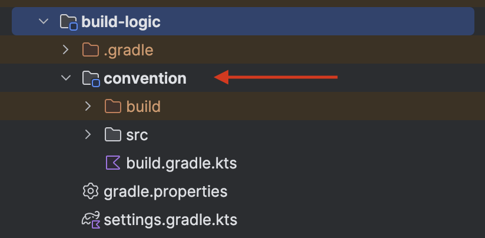

Convention plugins apply *conventions* to a build. They do this by applying *ecosystem* plugins such as AGP and KGP, and then configuring those plugins according to the convention used by your build.

In this tutorial, you will learn how you can migrate your project to use convention plugins in small and detailed steps. So let’s get started.

## Table of contents

## Setting up `build-logic` project

1. Start by creating the `build-logic` folder inside your root project.


1. Create a file named `settings.gradle.kts` inside the `build-logic` directory and add following configuration:

```kotlin
dependencyResolutionManagement {
		// 1. Setup repositories to download dependencies
    repositories {
        google()
        mavenCentral()
    }

    // 2. Create version catalog named `libs` from
    // the `libs.versions.toml` file already present in
    // the gradle folder.
    versionCatalogs {
        create("libs") {
            from(files("../gradle/libs.versions.toml"))
        }
    }
}

// 3. Set project name
rootProject.name = "build-logic"

// 4. Include the `convention` module that we will create next
include(":convention")
```

Here we have setup basic configuration for the build-logic project. This tutorial assumes that your project is using version catalog.

1. Create a `gradle.properties` file and add the following properties:

```
org.gradle.parallel=true
org.gradle.caching=true
org.gradle.configureondemand=true
```

1. Add `build-logic` as an included build in your `<root>/settings.gradle.kts` :

```kotlin
pluginManagement {
    // 1. Add build-logic as an includedBuild
    includeBuild("build-logic")

    repositories {
        google {
            content {
                includeGroupByRegex("com\\.android.*")
                includeGroupByRegex("com\\.google.*")
                includeGroupByRegex("androidx.*")
            }
        }
        mavenCentral()
        gradlePluginPortal()
    }
}
```

## Setting up convention module

1. Start by creating a directory called `convention` in your `build-logic` directory:



1. Create a `build.gradle.kts` inside the `convention` directory and add basic configuration:

```kotlin
import org.jetbrains.kotlin.gradle.dsl.JvmTarget

plugins {
    `kotlin-dsl`
}

// Note: Replace with your package name
group = "org.dreamerslab.newslayer.buildlogic"

// Configure the build-logic plugins to target JDK 17
// This matches the JDK used to build the project, and is not related to what is running on device.
java {
    sourceCompatibility = JavaVersion.VERSION_17
    targetCompatibility = JavaVersion.VERSION_17
}

kotlin {
    compilerOptions {
        jvmTarget = JvmTarget.JVM_17
    }
}

tasks {
    validatePlugins {
        enableStricterValidation = true
        failOnWarning = true
    }
}
```

1. Next we will add plugins to the version catalog that are required by the `build-logic` . Add these plugins to `gradle/libs.versions.toml` file:

```toml
[versions]
# ...
agp = "8.4.2"
androidTools = "31.4.2"
kotlin = "2.0.0"

[libraries]
# ...

# Dependencies of the included build-logic
android-gradlePlugin = { group = "com.android.tools.build", name = "gradle", version.ref = "agp" }
android-tools-common = { group = "com.android.tools", name = "common", version.ref = "androidTools" }
compose-gradlePlugin = { module = "org.jetbrains.kotlin:compose-compiler-gradle-plugin", version.ref = "kotlin" }
kotlin-gradlePlugin = { group = "org.jetbrains.kotlin", name = "kotlin-gradle-plugin", version.ref = "kotlin" }
```

1. Now apply these plugins in your `build-logic/convention/build.gradle.kts` file:

```kotlin
import org.jetbrains.kotlin.gradle.dsl.JvmTarget

plugins {
    `kotlin-dsl`
}

// Note: Replace with your package name
group = "org.dreamerslab.newslayer.buildlogic"

// Configure the build-logic plugins to target JDK 17
// This matches the JDK used to build the project, and is not related to what is running on device.
java {
    sourceCompatibility = JavaVersion.VERSION_17
    targetCompatibility = JavaVersion.VERSION_17
}

kotlin {
    compilerOptions {
        jvmTarget = JvmTarget.JVM_17
    }
}

tasks {
    validatePlugins {
        enableStricterValidation = true
        failOnWarning = true
    }
}

// 1.Add plugins here
dependencies {
    compileOnly(libs.android.gradlePlugin)
    compileOnly(libs.android.tools.common)
    compileOnly(libs.compose.gradlePlugin)
    compileOnly(libs.kotlin.gradlePlugin)
}
```

1. Next create the source set directory inside `convention` module:


## Creating configuration helper files

Let’s create the helper files that we will use to configure different plugins. We start by creating a file for project extensions:

### `ProjectExtensions.kt`

```kotlin
package org.dreamerslab.newslayer

import org.gradle.api.Project
import org.gradle.api.artifacts.VersionCatalog
import org.gradle.api.artifacts.VersionCatalogsExtension
import org.gradle.kotlin.dsl.getByType

val Project.libs
    get(): VersionCatalog = extensions.getByType<VersionCatalogsExtension>().named("libs")
```

### `Versions.kt`

```kotlin
package org.dreamerslab.newslayer

object Versions {
  const val COMPILE_SDK = 34
  const val MIN_SDK = 24
  const val TARGET_SDK = 34
}
```

### `KotlinAndroid.kt`

```kotlin
package org.dreamerslab.newslayer

import com.android.build.api.dsl.CommonExtension
import org.gradle.api.JavaVersion
import org.gradle.api.Project
import org.gradle.api.plugins.JavaPluginExtension
import org.gradle.kotlin.dsl.assign
import org.gradle.kotlin.dsl.configure
import org.gradle.kotlin.dsl.provideDelegate
import org.jetbrains.kotlin.gradle.dsl.JvmTarget
import org.jetbrains.kotlin.gradle.dsl.KotlinAndroidProjectExtension
import org.jetbrains.kotlin.gradle.dsl.KotlinJvmProjectExtension
import org.jetbrains.kotlin.gradle.dsl.KotlinTopLevelExtension

/**
 * Configure base Kotlin with Android options
 */
internal fun Project.configureKotlinAndroid(
    commonExtension: CommonExtension<*, *, *, *, *, *>,
) {
    commonExtension.apply {
        compileSdk = Versions.COMPILE_SDK

        defaultConfig {
            minSdk = Versions.MIN_SDK
        }

        compileOptions {
            sourceCompatibility = JavaVersion.VERSION_11
            targetCompatibility = JavaVersion.VERSION_11
        }
    }

    configureKotlin<KotlinAndroidProjectExtension>()
}

/**
 * Configure base Kotlin options
 */
private inline fun <reified T : KotlinTopLevelExtension> Project.configureKotlin() = configure<T> {
    // Treat all Kotlin warnings as errors (disabled by default)
    // Override by setting warningsAsErrors=true in your ~/.gradle/gradle.properties
    val warningsAsErrors: String? by project
    when (this) {
        is KotlinAndroidProjectExtension -> compilerOptions
        is KotlinJvmProjectExtension -> compilerOptions
        else -> TODO("Unsupported project extension $this ${T::class}")
    }.apply {
        jvmTarget = JvmTarget.JVM_11
        allWarningsAsErrors = warningsAsErrors.toBoolean()
        freeCompilerArgs.add(
            // Enable experimental coroutines APIs, including Flow
            "-opt-in=kotlinx.coroutines.ExperimentalCoroutinesApi",
        )
    }
}
```

### `AndroidCompose.kt`

```kotlin
package org.dreamerslab.newslayer

import com.android.build.api.dsl.CommonExtension
import org.gradle.api.Project
import org.gradle.kotlin.dsl.assign
import org.gradle.kotlin.dsl.configure
import org.gradle.kotlin.dsl.dependencies
import org.jetbrains.kotlin.compose.compiler.gradle.ComposeCompilerGradlePluginExtension

/**
 * Configure Compose-specific options
 */
internal fun Project.configureAndroidCompose(
    commonExtension: CommonExtension<*, *, *, *, *, *>,
) {
    commonExtension.apply {
        buildFeatures {
            compose = true
        }

        dependencies {
            val bom = libs.findLibrary("androidx-compose-bom").get()
            add("implementation", platform(bom))
            add("androidTestImplementation", platform(bom))
            add("implementation", libs.findLibrary("androidx-ui-tooling-preview").get())
            add("debugImplementation", libs.findLibrary("androidx-ui-tooling").get())
        }
    }

    extensions.configure<ComposeCompilerGradlePluginExtension> {
        enableStrongSkippingMode = true
    }
}
```

## Creating plugins

We will create following necessary plugins:

| Plugin                                    | Usage                                                     |
| ----------------------------------------- | --------------------------------------------------------- |
| AndroidApplicationConventionPlugin        | Configures base application                               |
| AndroidApplicationComposeConventionPlugin | Adds configuration for Compose to application module      |
| AndroidLibraryConventionPlugin            | Configures android library modules                        |
| AndroidLibraryComposeConventionPlugin     | Adds configuration for Compose to android library modules |

Let’s create these plugins:

### `AndroidApplicationConventionPlugin.kt`

```kotlin
package org.dreamerslab.newslayer

import com.android.build.api.dsl.ApplicationExtensio
import org.gradle.api.Plugin
import org.gradle.api.Project
import org.gradle.kotlin.dsl.configure

class AndroidApplicationConventionPlugin : Plugin<Project> {
    override fun apply(target: Project) {
        with(target) {
            with(pluginManager) {
                apply("com.android.application")
                apply("org.jetbrains.kotlin.android")
            }

            extensions.configure<ApplicationExtension> {
                configureKotlinAndroid(this)
                defaultConfig.targetSdk = Versions.TARGET_SDK
            }
        }
    }
}
```

### `AndroidApplicationComposeConventionPlugin.kt`

```kotlin
package org.dreamerslab.newslayer

import com.android.build.api.dsl.ApplicationExtension
import org.gradle.api.Plugin
import org.gradle.api.Project
import org.gradle.kotlin.dsl.apply
import org.gradle.kotlin.dsl.getByType

class AndroidApplicationComposeConventionPlugin : Plugin<Project> {
    override fun apply(target: Project) {
        with(target) {
            apply(plugin = "com.android.application")
            apply(plugin = "org.jetbrains.kotlin.plugin.compose")

            val extension = extensions.getByType<ApplicationExtension>()
            configureAndroidCompose(extension)
        }
    }
}
```

### `AndroidLibraryConventionPlugin.kt`

```kotlin
package org.dreamerslab.newslayer

import com.android.build.gradle.LibraryExtension
import org.gradle.api.Plugin
import org.gradle.api.Project
import org.gradle.kotlin.dsl.apply
import org.gradle.kotlin.dsl.configure

class AndroidLibraryConventionPlugin : Plugin<Project> {
    override fun apply(target: Project) {
        with(target) {
            with(pluginManager) {
                apply("com.android.library")
                apply("org.jetbrains.kotlin.android")
            }

            extensions.configure<LibraryExtension> {
                configureKotlinAndroid(this)
                defaultConfig.targetSdk = Versions.TARGET_SD
            }
        }
    }
}
```

### `AndroidLibraryComposeConventionPlugin.kt`

```kotlin
package org.dreamerslab.newslayer

import com.android.build.gradle.LibraryExtension
import org.gradle.api.Plugin
import org.gradle.api.Project
import org.gradle.kotlin.dsl.apply
import org.gradle.kotlin.dsl.getByType

class AndroidLibraryComposeConventionPlugin : Plugin<Project> {
    override fun apply(target: Project) {
        with(target) {
            apply(plugin = "com.android.library")
            apply(plugin = "org.jetbrains.kotlin.plugin.compose")

            val extension = extensions.getByType<LibraryExtension>()
            configureAndroidCompose(extension)
        }
    }
}
```

## Register plugins

Once you have created the plugins, you need to register them in `build-logic/convention/build.gradle.kts` :

```kotlin
import org.jetbrains.kotlin.gradle.dsl.JvmTarget

plugins {
    `kotlin-dsl`
}

group = "org.dreamerslab.newslayer.buildlogic"

// Configure the build-logic plugins to target JDK 17
// This matches the JDK used to build the project, and is not related to what is running on device.
java {
    sourceCompatibility = JavaVersion.VERSION_17
    targetCompatibility = JavaVersion.VERSION_17
}

kotlin {
    compilerOptions {
        jvmTarget = JvmTarget.JVM_17
    }
}

tasks {
    validatePlugins {
        enableStricterValidation = true
        failOnWarning = true
    }
}

dependencies {
    compileOnly(libs.android.gradlePlugin)
    compileOnly(libs.android.tools.common)
    compileOnly(libs.compose.gradlePlugin)
    compileOnly(libs.kotlin.gradlePlugin)
}

// 1. Register your plugins here
gradlePlugin {
    plugins {
        register("androidApplicationCompose") {
            id = "newslayer.android.application.compose"
            implementationClass = "org.dreamerslab.newslayer.AndroidApplicationComposeConventionPlugin"
        }
        register("androidApplication") {
            id = "newslayer.android.application"
            implementationClass = "org.dreamerslab.newslayer.AndroidApplicationConventionPlugin"
        }
        register("androidLibraryCompose") {
            id = "newslayer.android.library.compose"
            implementationClass = "org.dreamerslab.newslayer.AndroidLibraryComposeConventionPlugin"
        }
        register("androidLibrary") {
            id = "newslayer.android.library"
            implementationClass = "org.dreamerslab.newslayer.AndroidLibraryConventionPlugin"
        }
    }
}
```

When registering a plugin, we pass its `name`, a unique `id` and the `implementationClass` . We will later use the id to apply these plugins in our modules just like we apply an external plugin using its id.

### Add custom plugins to version catalog

We can now add these plugins inside our `gradle/libs.versions.toml` file:

```toml
[plugins]
# ...

# Plugins defined by this project
newslayer-android-application = { id = "newslayer.android.application", version = "unspecified" }
newslayer-android-application-compose = { id = "newslayer.android.application.compose", version = "unspecified" }
newslayer-android-library = { id = "newslayer.android.library", version = "unspecified" }
newslayer-android-library-compose = { id = "newslayer.android.library.compose", version = "unspecified" }
```

## Applying plugins in our project

We have successfully created custom plugins that we can now apply to our project modules. We will start by migrating the `app` module. Update the build gradle file as follows:

### `app/build.gradle.kts`

```kotlin
plugins {
    // ~~alias(libs.plugins.android.application)~~
    // ~~alias(libs.plugins.jetbrains.kotlin.android)~~
    // ~~alias(libs.plugins.compose.compiler)~~

		// Apply custom plugins here
    alias(libs.plugins.newslayer.android.application)
    alias(libs.plugins.newslayer.android.application.compose)
}

android {
    namespace = "org.dreamerslab.newslayer"

    // ~~compileSdk = 34~~

    defaultConfig {
        applicationId = "org.dreamerslab.newslayer"
        // ~~minSdk = 24~~
        // ~~targetSdk = 34~~

        versionCode = 1
        versionName = "1.0"

        testInstrumentationRunner = "androidx.test.runner.AndroidJUnitRunner"
        vectorDrawables {
            useSupportLibrary = true
        }
    }

    buildTypes {
        release {
            isMinifyEnabled = true
            proguardFiles(
                getDefaultProguardFile("proguard-android-optimize.txt"),
                "proguard-rules.pro",
            )
        }
    }

    // ~~compileOptions {~~
    //     ~~sourceCompatibility = JavaVersion.VERSION_17~~
    //     ~~targetCompatibility = JavaVersion.VERSION_17~~
    // }

    // ~~kotlin {~~
    //     ~~jvmToolchain(17)~~
    // ~~}~~

    // ~~buildFeatures {~~
    //     ~~compose = true~~
    // ~~}~~

    packaging {
        resources {
            excludes += "/META-INF/{AL2.0,LGPL2.1}"
        }
    }
}

dependencies {
		// ...

    // ~~implementation(platform(libs.androidx.compose.bom))~~
    // ~~implementation(libs.androidx.ui.tooling.preview)~~

    // ~~androidTestImplementation(platform(libs.androidx.compose.bom))~~

    // ~~debugImplementation(libs.androidx.ui.tooling)~~
}
```

We will also apply custom plugins to out android modules that use compose. I’ll apply it to the. `:common:ui` module.

### `common/ui/build.gradle.kts`

```kotlin
plugins {
    // ~~alias(libs.plugins.android.library)~~
    // ~~alias(libs.plugins.jetbrains.kotlin.android)~~
    // ~~alias(libs.plugins.compose.compiler)~~

		// Apply plugins
		alias(libs.plugins.newslayer.android.library)
    alias(libs.plugins.newslayer.android.library.compose)
}

android {
    namespace = "org.dreamerslab.newslayer.ui"
    // ~~compileSdk = 34~~

    defaultConfig {
        // ~~minSdk = 24~~

        testInstrumentationRunner = "androidx.test.runner.AndroidJUnitRunner"
        consumerProguardFiles("consumer-rules.pro")
    }

    // ~~compileOptions {~~
    //     ~~sourceCompatibility = JavaVersion.VERSION_17~~
    //     ~~targetCompatibility = JavaVersion.VERSION_17~~
    // ~~}~~

    // ~~kotlin {~~
    //     ~~jvmToolchain(17)~~
    // ~~}~~

    // ~~buildFeatures {~~
    //     ~~compose = true~~
    // ~~}~~
}

dependencies {
		// ...

    // ~~implementation(platform(libs.androidx.compose.bom))~~
    // ~~implementation(libs.androidx.ui.tooling.preview)~~

    // ~~androidTestImplementation(platform(libs.androidx.compose.bom))~~

    // ~~debugImplementation(libs.androidx.ui.tooling)~~
}
```

By following this approach, you can update your sub-modules to use build-logic plugins.

## Enable caching for faster builds

Add following properties to your `<root>/gradle.properties` to enable caching for faster builds:

```
# Enable caching between builds.
org.gradle.caching=true

# Enable configuration caching between builds.
org.gradle.configuration-cache=true
```

## Useful Resources

- https://developer.squareup.com/blog/herding-elephants/
- https://developer.android.com/build/migrate-to-catalogs
- https://github.com/android/nowinandroid
